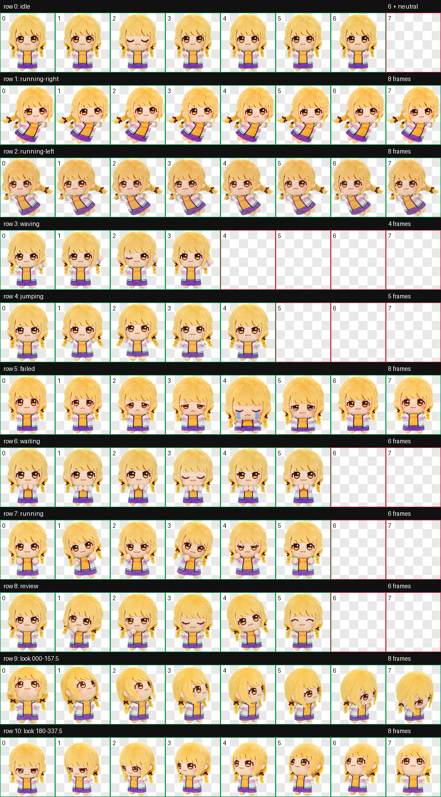
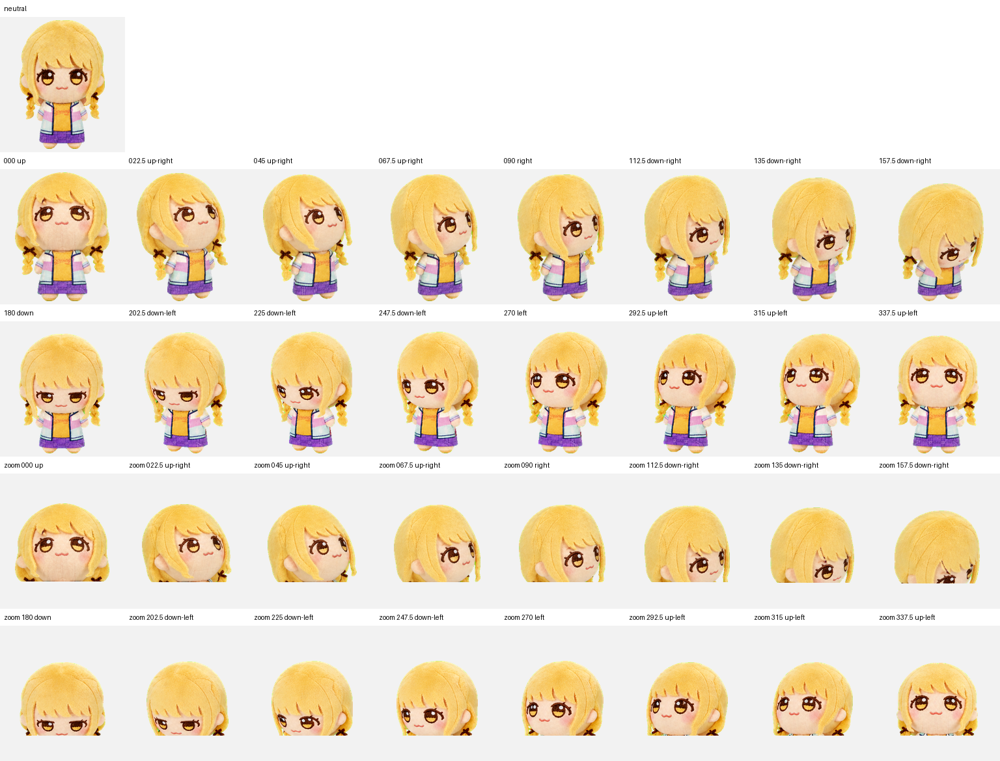

# 琴努努 Codex Pet

<p align="center">
  <a href="https://linux.do" alt="LINUX DO">
    
  </a>
</p>

> [!CAUTION]
> **非官方粉丝项目 / UNOFFICIAL FAN PROJECT**  
> 本项目与株式会社万代南梦宫娱乐（Bandai Namco Entertainment Inc.）、《偶像大师》或《学园偶像大师》官方没有隶属、合作、赞助、认可或授权关系。

一个以《学园偶像大师》角色藤田琴音为原型制作的 Codex v2 动画 pet。它采用软乎乎的棉花娃娃／ちびぐるみ风格，包含工作、等待、挥手、跳跃、失败反应、左右飞行以及 16 个视线方向。



## 安装

需要 Windows PowerShell 5.1 或 PowerShell 7：

```powershell
.\scripts\install.ps1
```

脚本会：

1. 校验仓库中的 `pet.json` 与 `spritesheet.webp`；
2. 如果已经安装同名 pet，先备份到 `%USERPROFILE%\.codex\pets-backup\kotone-nunu-<timestamp>`；
3. 安装到 `%USERPROFILE%\.codex\pets\kotone-nunu`；
4. 重新校验已安装副本。

安装完成后，重新选择 pet 或重启 Codex。卸载：

```powershell
.\scripts\uninstall.ps1
```

卸载脚本默认把当前安装移动到 `%USERPROFILE%\.codex\pets-backup`，不会直接删除。

## 动画规格

本包使用 Codex `spriteVersionNumber: 2`：

- 图集：`1536 × 2288` WebP，RGBA；
- 单格：`192 × 208`；
- 布局：8 列 × 11 行；
- 9 个标准状态行；
- 16 个顺时针视线方向；
- 未使用单格完全透明。

可运行本地结构校验：

```powershell
.\scripts\validate.ps1
```

## 动作预览

| 状态 | 预览 |
|---|---|
| idle |  |
| running-right |  |
| running-left |  |
| waving |  |
| jumping |  |
| failed |  |
| waiting |  |
| running |  |
| review |  |

16 向视线检查表：



## 权利声明

请在使用或 fork 前完整阅读 [RIGHTS-NOTICE.md](RIGHTS-NOTICE.md)。摘要如下：

- 藤田琴音、《学园偶像大师》、《偶像大师》及其角色设定、名称、标识、商标和相关知识产权属于各自权利人；主要权利标识为 `THE IDOLM@STER™ & ©Bandai Namco Entertainment Inc.`。
- 本仓库作者**不主张拥有底层作品、角色、商标或官方美术的任何权利**。
- 仓库没有收录用于制作过程的官方原图、官方网站图片、游戏截图或提取资源。
- `spritesheet.webp` 是基于官方角色形象制作的**非官方 AI 辅助粉丝衍生美术**，不是官方原图，不代表官方制作或授权。
- 仓库公开不等于该美术资产进入公有领域，也不代表作者有权授予其商业使用、再分发或再许可。
- 如权利人认为内容不合适，请通过仓库 Issue 联系；我们将优先处理移除请求。

## 许可证

本仓库不是“所有内容统一开源许可”的项目：

- `scripts/` 下由本项目原创的安装与校验脚本使用 [MIT License](LICENSE-CODE)；
- `pet/spritesheet.webp`、`docs/*.png`、`previews/*.gif` 及所有含角色形象的美术资产**不在 MIT License 范围内**，不提供任何超出适用法律及权利人许可的授权；
- `pet/pet.json` 仅作为兼容性元数据提供；其中角色名称不构成商标授权。

## 参考政策

以下链接仅用于说明本项目采用的保守权利处理方式，**不表示这些政策授权本仓库分发衍生 spritesheet**：

- [Bandai Namco Entertainment 游戏实况政策](https://www.bandainamcoent.co.jp/info/videopolicy/)——适用于个人分享自己游玩的影片、静止画和截图；
- [《学园偶像大师》应援广告规程](https://gakuen.idolmaster-official.jp/media/fankit/terms-of-cheering-ad/)——仅规定应援广告场景，不是本仓库的分发许可；
- [GitHub：Licensing a repository](https://docs.github.com/en/repositories/managing-your-repositorys-settings-and-features/customizing-your-repository/licensing-a-repository)——公开仓库本身不等于开源授权。

---

## English summary

This is an **unofficial, non-commercial fan project** inspired by Fujita Kotone from *Gakuen IDOLM@STER*. It is not affiliated with, sponsored, endorsed, or authorized by Bandai Namco Entertainment Inc. or the IDOLM@STER project.

The character, franchise, names, trademarks, designs, and related intellectual property belong to their respective rightsholders. The maintainers claim **no rights in the underlying work or official artwork**. No official source artwork, website images, extracted game assets, or screenshots are included in this repository.

The included sprite sheet is unofficial AI-assisted derivative fan art, not official artwork. Code under `scripts/` is MIT-licensed; character-bearing visual assets are excluded from that license and are not offered for commercial use, redistribution, or sublicensing. See [RIGHTS-NOTICE.md](RIGHTS-NOTICE.md).
